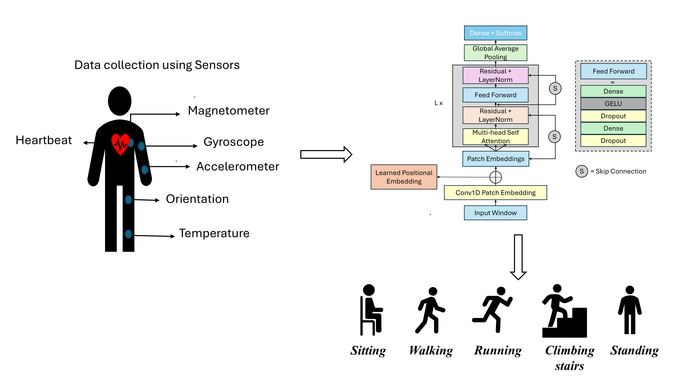

# Edge-Efficient Human Activity Recognition Using a Quantized Patch-Based Transformer
<p align="center">

[]()
[]()
[]()
[]()
[]()

</p>

---

## 📖 Overview

This repository contains the implementation, trained models, experimental results, and TensorFlow Lite benchmarks for the research paper:

> **"Edge-Efficient Human Activity Recognition Using a Quantized Patch-Based Transformer"**

The proposed framework introduces a **compact end-to-end patch-based Transformer architecture** specifically designed for **Human Activity Recognition (HAR)** in **edge computing environments**, where computational resources, memory, and inference latency are limited.

Unlike conventional Transformer models, our approach combines:

- ✅ Temporal Patch Embedding
- ✅ Lightweight Multi-Head Self-Attention
- ✅ Compact Transformer Encoder
- ✅ TensorFlow Lite Quantization
- ✅ Edge Deployment Benchmarking

to achieve an excellent balance between **recognition performance** and **computational efficiency**.
The overview of the entire methodology incororated in the work is shown below:




---

# 📑 Related Publication

**Paper Title**

> **Lightweight Patch-Based Transformer for Efficient Human Activity Recognition on Resource-Constrained Edge Devices**

**Authors**

Aasif Rashid Khanday, et al.

---

# 🎯 Key Contributions

✨ **Novel Lightweight Patch-Based Transformer**

- End-to-end Transformer architecture designed specifically for wearable sensor HAR.

✨ **Architectural Ablation Study**

- Effect of different temporal patch lengths
- Different Transformer encoder depths
- Trade-off analysis between accuracy and efficiency

✨ **TensorFlow Lite Deployment**

Four deployment-ready formats:

- FP32
- FP16
- INT8 Dynamic Range
- INT8 Full Integer

✨ **Edge Benchmarking**

Comprehensive evaluation of:

- Model Size
- Inference Latency
- Accuracy
- Macro F1-score
- Memory Efficiency

---

# 🧠 Model Architecture

```
Raw Sensor Signals
        │
        ▼
Window Segmentation
        │
        ▼
Normalization
        │
        ▼
Temporal Patch Embedding
        │
        ▼
Positional Encoding
        │
        ▼
Transformer Encoder
(Multi-Head Self Attention)
        │
        ▼
Global Average Pooling
        │
        ▼
Classification Head
        │
        ▼
Predicted Activity
```

---

# 📊 Datasets

The proposed framework has been evaluated on two widely used benchmark HAR datasets.

| Dataset | Activities | Sensors |
|----------|------------|----------|
| **WISDM** | Daily Activities | Smartphone Accelerometer & Gyroscope |
| **PAMAP2** | Physical Activities | IMU + Heart Rate |

The dataset is publicly available and can be downloaded from the following links:

🔗 ((https://www.cis.fordham.edu/wisdm/dataset.php))
🔗 ((https://archive.ics.uci.edu/dataset/231/pamap2+physical+activity+monitoring))

Please download the dataset from port and place it in the appropriate directory before running the code.

For complete details regarding the acquisition protocol, tasks, and experimental design, refer to the dataset paper.

---

# ⚙️ Data Preprocessing

The raw sensor streams undergo the following pipeline before training:

```
Raw Sensor Data
      │
      ▼
Missing Value Removal
      │
      ▼
Normalization
      │
      ▼
Sliding Window Segmentation
      │
      ▼
Overlap Generation
      │
      ▼
Patch Creation
      │
      ▼
Transformer Input
```

---

# 🔬 Experimental Study

We systematically investigate the influence of

- Patch Length
- Number of Transformer Encoder Layers
- Quantization Strategy

on

- Classification Accuracy
- Macro F1 Score
- Model Size
- Inference Latency
- Edge Deployment Performance

---

# 📦 TensorFlow Lite Quantization

The trained model is converted into multiple deployment formats.

| Format | Purpose |
|----------|----------|
| FP32 | Baseline |
| FP16 | Reduced Memory |
| INT8 Dynamic | Fast Edge Inference |
| INT8 Full Integer | Maximum Compression |

---

# 📈 Performance Highlights

## WISDM

| Metric | Result |
|----------|----------|
| Accuracy | **96.77%** |
| Macro F1 | High |
| Best Compression | **95.55%** Model Size Reduction |
| Latency Improvement | **~99%** |

---

## PAMAP2

| Metric | Result |
|----------|----------|
| Accuracy | **98.48%** |
| Macro F1 | High |
| Best Compression | **89.80%** Model Size Reduction |
| Latency Improvement | **~99%** |

---

# 🏆 Main Findings

✔ Moderate temporal patching provides the best trade-off between computational cost and recognition performance.

✔ INT8 Dynamic Quantization dramatically reduces model size while maintaining excellent classification accuracy.

✔ TensorFlow Lite enables real-time HAR deployment on edge devices with minimal accuracy degradation.

✔ The proposed lightweight Transformer is suitable for wearable and embedded AI applications.

---

# 📂 Repository Structure

```
Path-based-transformer-with-quatization/
│
├── code/
│   ├── Baseline transformer/
│   └── Quantized model/
│
├── results/
│   ├── WISDM/
│   ├── PAMAP2/
|
|──models
│
├── Ablation study/
│
└── README.md
```

---

# 🚀 Getting Started

## Clone Repository

```bash
git clone https://github.com/AASIFRASHIDKHANDAY/PATH BASED TRANSFORMER WITH QUANTIZATION.git

cd PATH BASED TRANSFORMER WITH QUANTIZATION
```

Install dependencies

```bash
pip install -r requirements.txt
```

Train the model

```bash
python train.py
```

Evaluate

```bash
python evaluate.py
```

Convert to TensorFlow Lite

```bash
python quantize.py
```

---

# 📊 Experimental Results

The repository includes:

- Training Curves
- Validation Curves
- Confusion Matrices
- ROC Curves
- FLOPs Analysis
- Parameter Analysis
- Quantization Comparison
- Latency Benchmarks
- Ablation Studies

---

# 💻 Edge Deployment

The exported TensorFlow Lite models are optimized for:

- 📱 Smartphones
- ⌚ Wearables
- 🤖 IoT Devices
- 📡 Embedded Systems
- 🔋 Low-Power Edge AI Platforms


---

# ⭐ Acknowledgements

This work utilizes the publicly available:

- WISDM Dataset
- PAMAP2 Dataset

We thank the authors for making these benchmark datasets publicly accessible.

---

# 📧 Contact

**Aasif Rashid Khanday**

Department of Computer Science,
Jamia Millia Islamia, New Delhi, India

📩 aasifrashidkhanday@gmail.com

For questions, suggestions, or collaborations, feel free to open an Issue or submit a Pull Request.

---

<div align="center">

### ⭐ If you find this repository useful, please consider giving it a star!

**Advancing Lightweight AI for Edge Intelligence**

</div>
